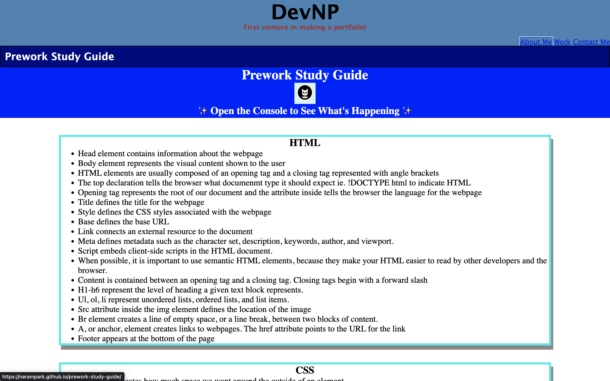

# Na Ram Park's Portfolio

## Description
This is my first attempt at creating a portfolio from scratch using html and css. It was made to showcase what I can do and as a portfolio I can show to a potential employer. Through making this portfolio I've learned that I have a lot more to learn about CSS. There were many times I just couldn't get it to do what I wanted it to do.

## Credits
normalize.css v8.0.1 | MIT License | github.com/necolas/normalize.css

## Github Deployment
https://narampark.github.io/wk2hw-portfolio/

## Screenshot
